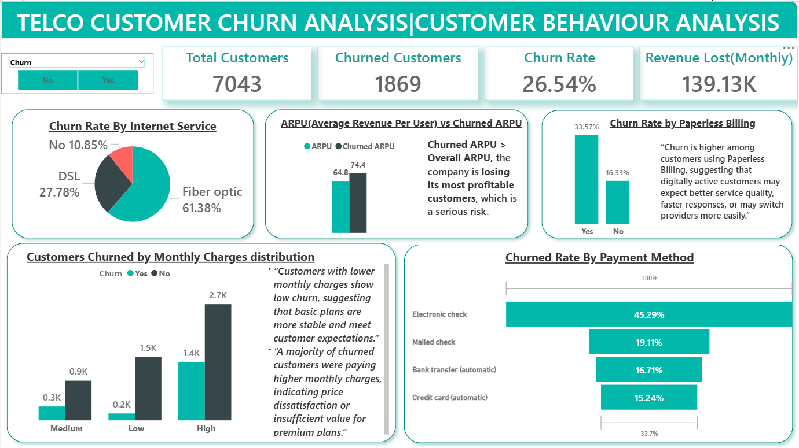

# Telco Customer Churn Analysis — Power BI

This project is an end-to-end Customer Churn Analysis for a telecom dataset built in **Power BI**.  
It identifies churn drivers, quantifies revenue impact, and provides actionable insights for business retention strategies.

---

## 📁 Project Files

---

## 🎯 Project Objective
To identify *why* customers churn, who is most at risk, and how churn impacts monthly revenue.  
The dashboard highlights customer behavior patterns across contract types, tenure, billing, internet service, and payment methods.

---

## 🔑 Key KPIs & Measures
- **Churn Rate**
- **Total Customers**
- **Churned Customers**
- **Revenue Lost (Monthly)**
- **ARPU (Average Revenue Per User)**
- **Churned ARPU**
- **Churn Rate by Tenure**
- **Churn Rate by Contract Type**
- **Churn Rate by Payment Method**
- **Churn by Monthly Charges**
- **Internet Service Churn Distribution**

---

## 🧠 Key Insights

### **1. Contract Type**
- Month-to-Month contracts have the **highest churn (~42.7%)**  
- One-Year and Two-Year customers have significantly lower churn  
- Longer contracts = higher customer loyalty

### **2. Tenure**
- 0–6 months customers churn the most  
- Indicates onboarding & initial service experience issues  
- High-tenure customers rarely churn

### **3. Payment Method**
- Manual payment customers have much higher churn  
- AutoPay customers are stable and loyal  
- Payment friction is a major churn driver

### **4. Monthly Charges**
- High monthly charge customers churn more  
- Indicates insufficient value or pricing dissatisfaction

### **5. Internet Service**
- Fiber optic users have the highest churn in the dataset  
- DSL users churn less  
- Suggests performance/expectation gaps

### **6. Revenue Impact**
- Monthly revenue lost from churn is **significant (~139K)**  
- Churned ARPU > Overall ARPU → high-value customers are leaving

---

## 📊 Dashboards

### **📌 Summary Dashboard**

### **📌 Customer Behaviour Dashboard**

---

## 🛠 Tools & Techniques
- **Power BI Desktop**  
- **DAX (Measures & Calculated Columns)**  
- Data modeling  
- Visualization design  
- KPI cards, bar charts, donut charts, slicers, & tooltips

---

## 📥 How to Use This Project
1. Download the `.pbix` file  
2. Open in **Power BI Desktop**  
3. Use slicers (Churn, Tenure Group, Contract Type, Payment Method)  
4. Explore the visual insights and customer segmentation  

---

## 🔄 Dataset Info
Dataset: Telco Customer Churn Dataset  
- Data Source: Kaggle
- No personally identifiable information is included
- Used for learning & analytics portfolio purposes

---

## 👨‍💻 Author
**Arun Kumar** — Data Analyst | Power BI Developer  
📎 LinkedIn: www.linkedin.com/in/arunkumardatika  
📎 GitHub: *https://github.com/Arundatika/Telco-customer-churn-analysis-powerbi*

---

## 📬 Contact
For collaboration or project feedback: *datika496@gmail.com*

